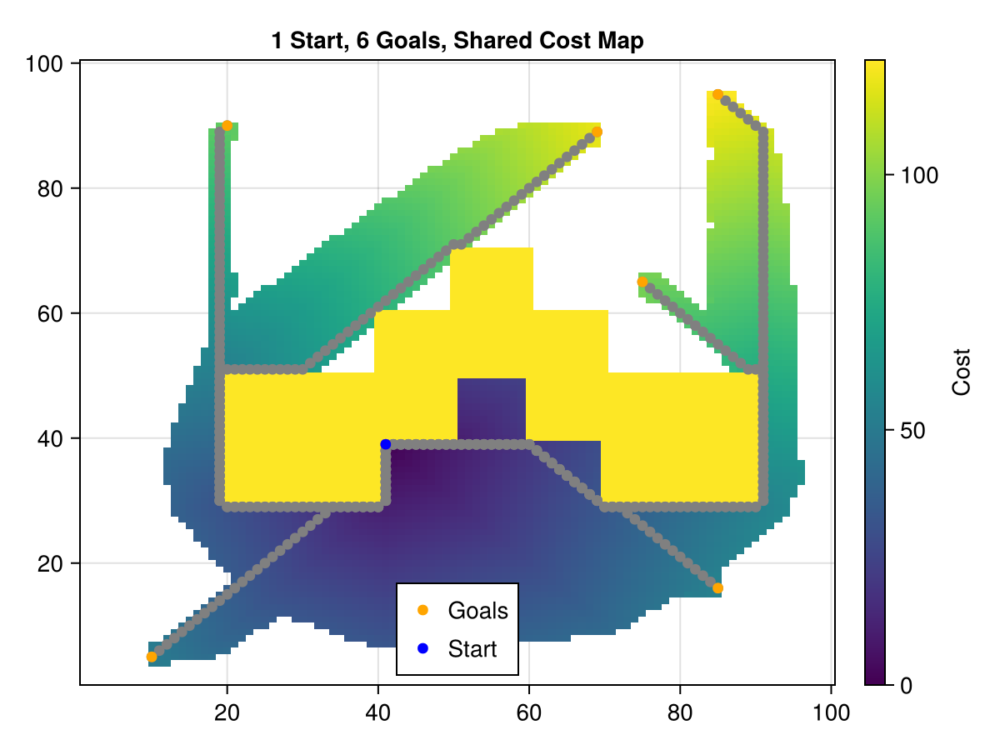
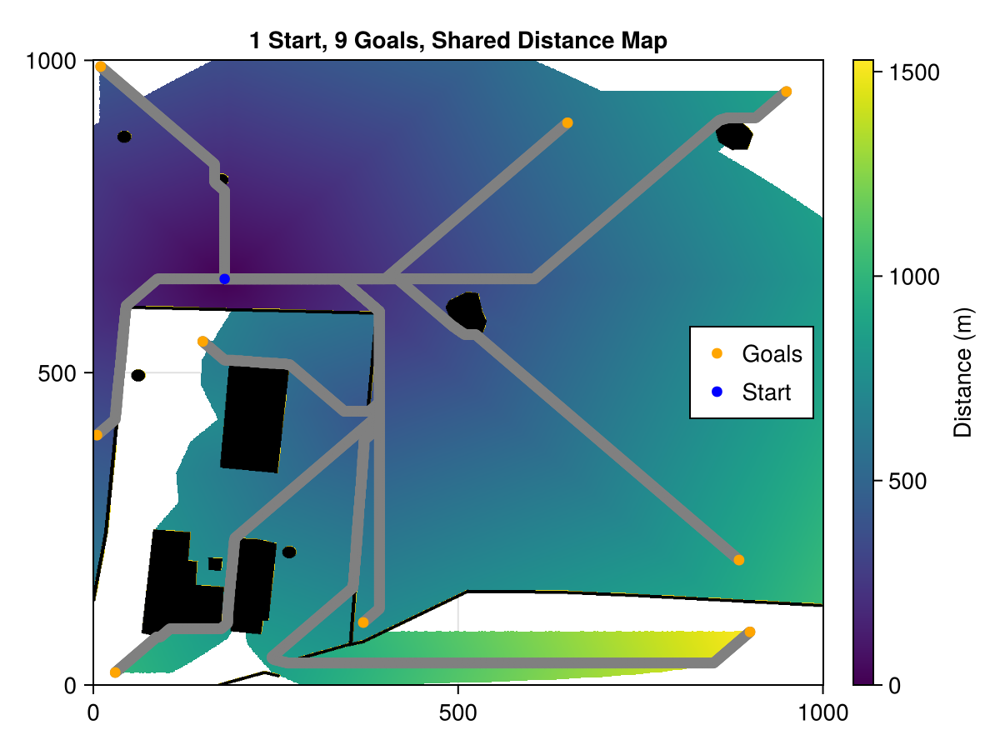

```@meta
CurrentModule = AStarGridSearch
```

# AStarGridSearch

## Quick Intro

This package contains types and methods for searching for paths on a 2D grid using the A* algorithm. Its main use is to get the path cost (distance), but it can return the full path as well. The PathCost type is set up in such a way that it can be used as a cost function for optimization routines. A PathCost is created for a set start cell; searches for multiple goal cells can be performed while keeping the same cost map between them. This means distances to intermediate cells don't need to be re-computed each time.

Following is a quick example of the main functionality of this package.

```@repl
using AStarGridSearch

occupancy = zeros(Bool, 10, 10); # open area
obstacle = CartesianIndex.([
    tuple.(2, 3:5)...,
    tuple.(3, 3:5)...,
    tuple.(4, 4:6)...,
    tuple.(5, 5:7)...,
    tuple.(6, 4:6)...,
    tuple.(7, 3:5)...,
    tuple.(8, 3:5)...,
]);
occupancy[obstacle] .= 1;
occupancy # shown with obstacle

start = CartesianIndex(4, 3);
resolution = (1, 1);
pathCost = PathCost(start, occupancy, resolution); # construct search object

goal = CartesianIndex(7, 9);
pathCost(goal) # calculate distance to goal; must be called before other methods
getPath(pathCost, goal) # full path from start to goal if it exists
finalOrientation(pathCost, goal) # angle in radians between the last two cells
pathCost(goal) # returns saved value, no new computations
pathCost(CartesianIndex(4, 9)) # run with new goal; computes quicker due to saved costs
```

Here are examples of the resulting paths and cost maps from the algorithm. The code that generated these can be found in the scripts directory of the repo:






## Further Info

See below for further details on each type and method.

```@index
```

```@autodocs
Modules = [AStarGridSearch]
```
